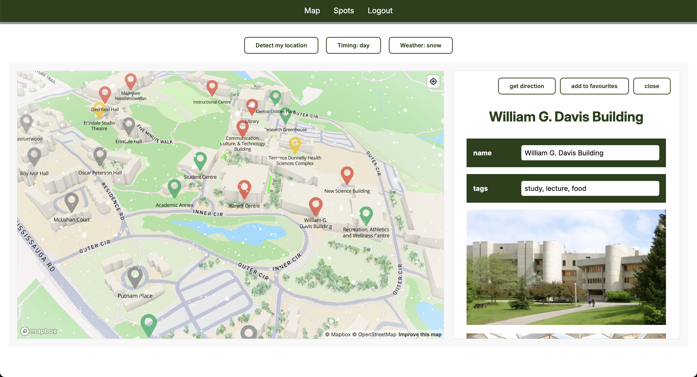

# UTM Live 🗺️
This Django full-stack app is an interactive `3D map` of the `UTM campus`, highlighting all of the famous study spots for students to come and have a look! What is your style? Quiet, crowded, fancy, or simple? All will be listed! 

*(I always love studying outside, anywhere besides home. Thus, I would love to know all of the nice study spots around my university campus. But there are so many of them! Therefore I decided to create this app to act as an interactive 3D map so that I can view all of them in one frame, plus some additional features!)*

## Features

- Personalized map for UTM campus, with 3D environment and buildings.
- Dynamic lighting and weathering.
- Clear information about different locations.
- Allow users to mark places as favourites.

## How It's Made:

**Tech used:** Python, Django, Mapbox, HTML, CSS, JavaScript, PostgreSQL.

The application is built using Django’s `model-view-template` (MVT) architecture to manage both frontend rendering and backend logic. The interactive map is fully custom-built using `mapbox gl js` and `mapbox studio`, integrating custom `geojson` schemas and `vector tilesets` to visualize campus locations such as study areas, dining spots, and buildings. 

All location metadata and spatial relationships are stored in a `postgresql` database hosted on `supabase`, allowing efficient querying and future scalability.User authentication is implemented using Django’s built-in `auth system` with a custom user model and `JWT` tokens for apis.

## What I Learned Through This Project:

- Design custom 3D map using Mapbox.
- Make models and datasets for all locations within the campus.
- Define new user model with Django authentication system.

